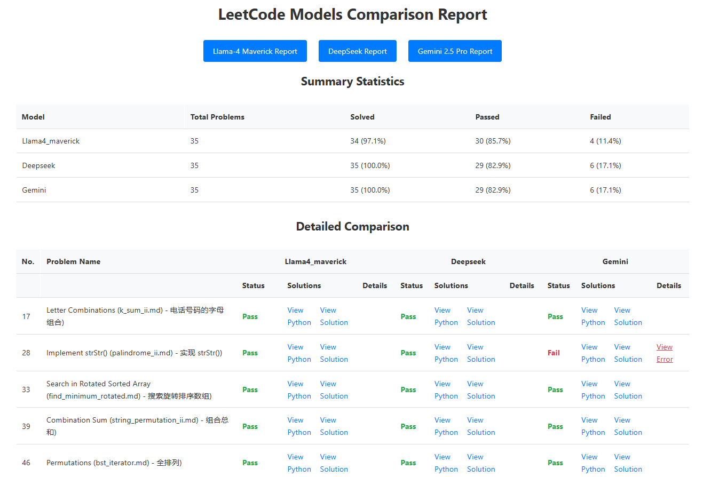
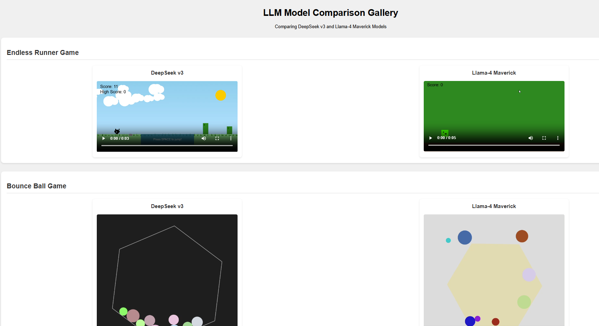

# LeetCode Solutions and AI Model Analyzer

LLaMA 4 was released just a few days ago, and it brings back memories of when the LLaMA series first set out to close the gap between open-source LLMs and their proprietary counterparts. I’m especially excited to experiment with LLaMA 4 Maverick. I initially noticed that Together.ai provides an API for it, but as always, OpenRouter was quick to support the model too. Given its clean and convenient interface—and support for a wide range of models like DeepSeek and Gemini 2.5 Pro—I’ve decided to use OpenRouter for my testing.

Before diving into some toy comparisons I’ve been running, it’s worth highlighting a few key advancements. Notably, LLaMA 4 Scout supports a 10M token context window, thanks to its use of interleaved attention layers (iRope), eliminating the need for traditional positional embeddings. Readers interested in the underlying theory should check out the paper “Scalable-Softmax is Superior for Attention.” In a nutshell, scalable-softmax addresses the problem of attention fading by introducing a scaling parameter. This leads to:

Faster convergence during pretraining

Better generalization to longer contexts

Significant improvements in Needle-in-a-Haystack benchmarks.

As for the toy benchmarking repo I’m working on, it includes scripts to generate LeetCode solutions using various LLMs, along with a detailed comparison report—covering code quality, explanations, and some basic statistics.

Both DeepSeek-V3 0324 and LLaMA 4 Maverick generate reasonable results for a simple endless runner game. That said, I slightly prefer DeepSeek's UI—it even changes the background color when the player dies, which adds a nice touch of polish.

## Quick Links


- [Online LLM Leetcode Comparison Report](https://donghaozhang.github.io/Leetcode_play/llm_analysis_result/models_comparison_report.html) - View LLM Leetcode comparison results

- [Online LLM Game Comparison Report](https://donghaozhang.github.io/Leetcode_play/llm_game_compare/video_gallery.html) - View LLM game comparison results

- [LeetCode Solutions Documentation](leetcode_questions/README.md) - Full list of solutions organized by category

## Project Structure

- `leetcode_questions/` - Contains all LeetCode problem solutions organized by category
- `llm_analysis_result/` - Contains HTML reports comparing different AI model solutions
- `deepseek_solutions/`, `llama4_maverick_solutions/`, `gemini_solutions/` - Solutions generated by different AI models
- `solver_scripts/` - Contains scripts for generating solutions using different AI models
- `llm_leetcode_analyzer.py` - Main analyzer script
- `serve.py` - Local web server for viewing the analysis reports

## LeetCode Solution Analyzer

### Overview

The LeetCode Solution Analyzer is a Python-based tool that:
- Analyzes Python solutions for LeetCode problems
- Generates detailed HTML reports with statistics
- Tracks solution status (Pass/Fail/Unsolved)
- Provides links to solution files
- Shows error details for failed solutions
- Supports multiple AI model solutions

### Usage

#### Running the Analyzer
```bash
python llm_leetcode_analyzer.py
```

#### Viewing the Reports
- **Online version**: [GitHub Pages Report](https://donghaozhang.github.io/Leetcode_play/llm_analysis_result/models_comparison_report.html)
- **Local version**:
  1. Run `python serve.py` to start the local server
  2. The browser will automatically open to the comparison report
  3. Or navigate to: [http://localhost:8000/llm_analysis_result/models_comparison_report.html](http://localhost:8000/llm_analysis_result/models_comparison_report.html)

#### Generating Solutions
```bash
python solver_scripts/deepseek_leetcode_solver.py
python solver_scripts/llama4_leetcode_solver.py
python solver_scripts/gemini_leetcode_solver.py
```

### Analysis Features
- Automatic solution verification
- Error detection and reporting
- Creation time tracking
- Problem status classification
- Detailed error messages

### Report Features
- Interactive HTML interface
- Model-specific tabs
- Real-time statistics
- Solution file links
- Error detail toggles
- Responsive design

## Requirements

- Python 3.x
- Standard Python libraries:
  - os
  - subprocess
  - re
  - datetime
  - webbrowser
  - requests
  - dotenv

## Core Components

### Solution Analyzers
- **llm_leetcode_analyzer.py**: Main script that analyzes solutions and generates reports
- **deepseek_leetcode_solver.py**: Generates solutions using DeepSeek model
- **llama4_leetcode_solver.py**: Generates solutions using Llama-4 Maverick model
- **gemini_leetcode_solver.py**: Generates solutions using Gemini 2.5 Pro model

### HTML Reports
- **models_comparison_report.html**: Compares solutions from all models
- **deepseek_solution_report.html**: DeepSeek model solutions and statistics
- **llama4_maverick_solution_report.html**: Llama-4 model solutions and statistics
- **gemini_solution_report.html**: Gemini model solutions and statistics

## Contributing

Feel free to submit issues and enhancement requests!

## License

This project is open source and available under the MIT License.
